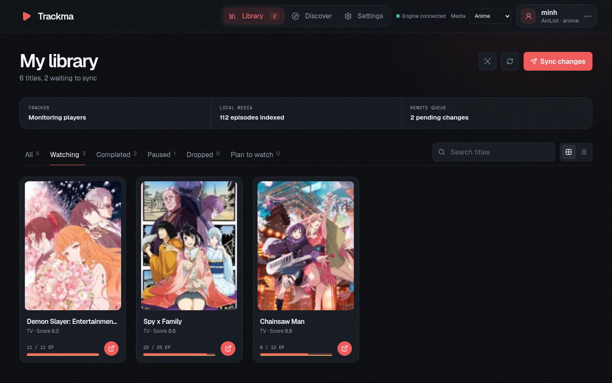
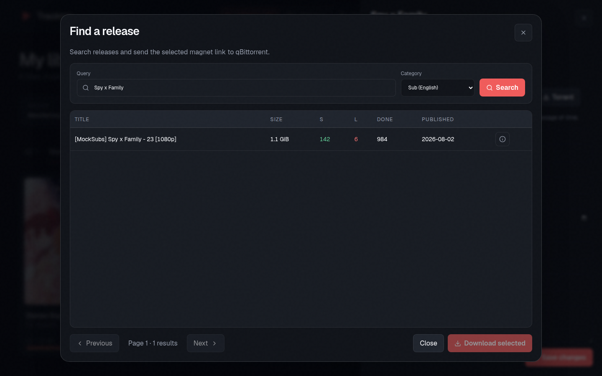

# Trackma

A desktop media-list manager with a modern React interface, native playback
integration, automatic episode tracking, and direct synchronization with your
online list.

This repository is a personal fork of the original
[Trackma](https://github.com/z411/trackma) project. It keeps Trackma's mature
Python engine and service integrations while replacing the previous GTK and Qt
widget interfaces with a single web-based desktop experience.

## Preview



<details>
<summary>Torrent search and qBittorrent integration</summary>



</details>

## What This Fork Adds

- A responsive React and TypeScript interface rendered inside a native desktop
  window.
- A compact top navigation for Library, Discover, Settings, media selection,
  connection state, and account management.
- A library that opens on **Watching** by default, with grid and list layouts,
  title search, status filters, and sync state at a glance.
- A single episode-progress bar that distinguishes watched episodes, aired
  episodes, and files available locally.
- A title drawer with progress editing, score and status controls, notes, tags,
  dates, alternate titles, AniList links, Play Next, random playback, local
  folder access, and torrent search.
- Nyaa torrent search in a dedicated dialog with subtitle/category filters,
  release information, pagination, and direct qBittorrent downloads.
- Remote catalog search and list additions without leaving the application.
- Safer media matching, account handling, network behavior, runtime isolation,
  and local-library scanning.
- Native system tray support, remembered window geometry, notifications, and
  light, dark, or system theme selection.

## Supported Services

Trackma can manage lists from:

- [AniList](https://anilist.co/) — anime and manga
- [Kitsu](https://kitsu.app/) — anime, manga, and drama
- [MyAnimeList](https://myanimelist.net/) — anime and manga
- [Shikimori](https://shikimori.one/) — anime and manga
- [VNDB](https://vndb.org/) — visual novels

Available features vary according to the capabilities of each service and
media type.

## How It Works

Trackma remains a native desktop application. The interface uses web
technology, but it does not require a browser tab or a separately hosted web
server in normal use.

```text
React + TypeScript interface
          |
       QWebChannel
          |
Python desktop bridge + Qt WebEngine window
          |
Trackma engine, trackers, local library, and service APIs
```

- `trackma/ui/web/frontend/` contains the React application.
- `trackma/ui/web/assets/` contains the production frontend bundle loaded by
  the desktop application.
- `trackma/ui/web/` provides the PyQt6 WebEngine window and the typed bridge
  between JavaScript and Python.
- `trackma/engine.py` and `trackma/data.py` coordinate local state, remote list
  synchronization, playback, and media tracking.
- `trackma/lib/` contains service, Nyaa, and qBittorrent integrations.
- `trackma/tracker/` contains player-detection backends.

## Requirements

- Python 3.9 or newer
- PyQt6 and PyQt6-WebEngine
- A supported media player such as mpv
- Node.js 24 when rebuilding or developing the frontend
- qBittorrent with its Web UI enabled for direct torrent downloads (optional)

Some tracker backends have additional platform-specific dependencies:

| Tracker | Purpose | Dependency |
| --- | --- | --- |
| inotify | Immediate filesystem/player detection on Linux | `inotify` or `pyinotify` |
| Polling | Portable fallback detection | `lsof` on POSIX systems |
| MPRIS | Linux desktop media-player detection | `jeepney` |
| Plex | Plex session detection | None |
| Kodi | Kodi session detection | None |
| Jellyfin | Jellyfin session detection | None |
| Win32 | Windows media detection | None |

## Install From This Fork

Install the current branch directly from GitHub:

```sh
python -m pip install \
  'trackma[ui] @ git+https://github.com/Trung0Minh/trackma.git@modern-ui-redesign'
```

Add the optional tracker dependencies when needed:

```sh
python -m pip install \
  'trackma[ui,trackers] @ git+https://github.com/Trung0Minh/trackma.git@modern-ui-redesign'
```

Then launch Trackma:

```sh
trackma
```

The `trackma-qt` command remains an alias for the same web-based desktop
application.

## Build From Source

```sh
git clone --branch modern-ui-redesign \
  https://github.com/Trung0Minh/trackma.git
cd trackma

python -m venv .venv
source .venv/bin/activate
python -m pip install --upgrade pip

cd trackma/ui/web/frontend
npm ci
npm run build
cd ../../../..

python -m pip install -e '.[ui,trackers]'
trackma
```

The frontend build writes directly to `trackma/ui/web/assets`, so the packaged
desktop application can load it without a development server.

## Frontend Development

Install dependencies and start Vite:

```sh
cd trackma/ui/web/frontend
npm ci
npm run dev
```

In another terminal, launch the native shell against Vite:

```sh
trackma --dev-url http://127.0.0.1:5173
```

The standalone browser mock is available at:

```text
http://127.0.0.1:5173/?mock=1
```

## Quality Checks

Python:

```sh
ruff check trackma hooks tests
mypy trackma
python -m compileall -q trackma hooks tests
python -m pytest -q
```

Frontend:

```sh
cd trackma/ui/web/frontend
npm run lint
npm run typecheck
npm test
npm run build
npm run test:e2e
```

GitHub Actions runs the frontend suite, Python checks across supported Python
versions, and a package build on every push and pull request.

## Configuration

Trackma stores user configuration below the platform-specific configuration
directory, normally `~/.config/trackma/` on Linux. The web desktop window keeps
its UI settings in `ui-web.json`; accounts and engine settings remain compatible
with Trackma's existing data model.

Configure these features from the Settings screen:

- media player and library directories
- automatic scanning and playback tracking
- synchronization behavior
- status and date automation
- qBittorrent connection details
- default Nyaa category and filtering
- tray behavior, notifications, window geometry, theme, and view mode

## Credits And License

This fork is built on the original Trackma project by
[z411](https://github.com/z411) and its contributors. The Python engine,
service integrations, and core architecture come from that project; this fork
focuses on a redesigned desktop experience and related integration work.

Trackma is free software licensed under the GNU General Public License v3 or
later. See [COPYING](COPYING) for the complete license text.
